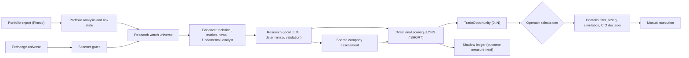

# Agentic Portfolio — Stage 4.0

A personal, human-controlled investment research system. It reads a real
portfolio export, scans a production exchange universe, researches candidates
with a local LLM, scores directional trade opportunities and prepares a
simulated, reviewable decision. **It never sends orders**: execution is manual
and every downstream step requires an explicit operator choice.

The architecture source of truth is
[`STAGE_4_0_ARCHITECTURE.md`](STAGE_4_0_ARCHITECTURE.md).

## What the system does



Principles enforced in code and tests:

- real portfolio state and proposed state are separate; no step mutates the
  portfolio, submits a broker order or executes automatically;
- Python owns deterministic finance (risk, sizing, technical indicators,
  score arithmetic); the LLM extracts, synthesizes and scores within validated,
  versioned contracts;
- unknown is safer than fabricated certainty: missing evidence degrades or
  blocks, it is never invented;
- every persisted output carries contract and policy versions; frozen
  contracts change only through an explicit, documented revision.

## Repository layout

| Path | Content |
| --- | --- |
| `app/portfolio`, `app/analysis` | portfolio import, risk state, technical analysis |
| `app/scanner` | universe, eligibility, history quality, watch universe, research integration |
| `app/ai` | evidence providers, research, scoring, company assessment, local LLM provider |
| `app/cio` | portfolio filter, proposals, simulation, CIO decision |
| `app/e2e` | Stage 4 orchestration, replenishment, shadow ledger |
| `tools/` | live runners and audits (`python -m tools.<name>`) |
| `scripts/` | `Invoke-Stage4Validation.ps1` (VS Code / PowerShell) |
| `tests/` | offline regression (no network, providers and LLM mocked) |
| `docs/` | one document per checkpoint and contract revision |
| `config/` | scanner policies and reference data |
| `data/` | local inputs, caches and state — **git-ignored, personal data** |

## Setup

Requirements: Python 3.10 or newer (tested on 3.10 and 3.12), and for live
runs [Ollama](https://ollama.com) with the `qwen3:8b` model and internet access
to Yahoo Finance.

```powershell
python -m venv .venv
.\.venv\Scripts\Activate.ps1
pip install -r requirements.txt -r requirements-scanner-history.txt
ollama pull qwen3:8b            # live runs only
```

Universe acquisition from EODHD needs the environment variable
`EODHD_API_TOKEN`. Never commit tokens or the contents of `data/`.

Keep the repository outside a synced folder (OneDrive, Dropbox) if possible:
SQLite files under sync can be locked or corrupted during writes.

## Validation

```powershell
# offline regression
python -m pytest -q -p no:cacheprovider

# Unit + Replay (offline, about two minutes)
powershell -ExecutionPolicy Bypass -File .\scripts\Invoke-Stage4Validation.ps1

# add one bounded LIVE replenishment run (Ollama + Yahoo, 20-40 minutes)
powershell -ExecutionPolicy Bypass -File .\scripts\Invoke-Stage4Validation.ps1 -Level All -MaxWaves 2 -RunId <root S4.0A run id>
```

Every level works on a sandbox copy of `data/state/portfolio_cio.db`, verifies
zero broker orders, portfolio mutations and automatic executions, and checks
that the production database hash is unchanged. Results, including a research
inspection and the acceptance checks of every contract revision, are written to
`data/cache/e2e/stage4/validation/<UTC stamp>/summary.md`. GitHub Actions runs
the offline regression on Windows and Linux for every push. Details:
[`docs/E2E-S4.0A-VALIDATION-HARNESS.md`](docs/E2E-S4.0A-VALIDATION-HARNESS.md).

## Shadow ledger

Every scored directional hypothesis, above or below the gate, is recorded in
`data/state/shadow_ledger.db` (automatically after each live validation) to
measure what it would have earned:

```powershell
python -m tools.shadow_ledger measure                                   # returns after 5/10/20 sessions
python -m tools.shadow_ledger report --out .\data\cache\shadow\report   # by score bucket
python -m tools.shadow_ledger list --complete-only --csv .\data\cache\shadow\ledger.csv  # one row per hypothesis
```

The ledger has no effect on decisions; it provides the outcome evidence needed
before any change to the score thresholds. Details:
[`docs/E2E-S4.0B-SHADOW-LEDGER.md`](docs/E2E-S4.0B-SHADOW-LEDGER.md).

## Current status (2026-10-01)

- The live Stage 4 chain runs end to end without processing failures: about
  half of the researched LONG and SHORT hypotheses reach `COMPLETE` research
  with HIGH evidence quality and a full score.
- No hypothesis has yet passed the materialization gate (confidence-adjusted
  score ≥ 60; observed 49–59). The shadow ledger is collecting outcome data
  to evaluate that threshold.
- Research and scoring contracts were revised during the live completion
  (AI-8C.2-R1–R3, AI-8C.3-R1–R2.2), each accepted with live evidence; see
  section 24 of the architecture document.

## Documentation

- [`STAGE_4_0_ARCHITECTURE.md`](STAGE_4_0_ARCHITECTURE.md) — system model,
  invariants, checkpoint map and governance.
- `docs/E2E-S*.md` — checkpoint documents (scanner, research integration,
  Stage 4 orchestration, validation harness, shadow ledger).
- `docs/AI-8C.*-R*.md` — contract revisions with reason, impact, tests and
  acceptance evidence.
- `STAGE_3_0_ARCHITECTURE.md`, `CIO_DEMO_ROADMAP.md` — historical baselines.

This project is a personal research tool, not investment advice.
