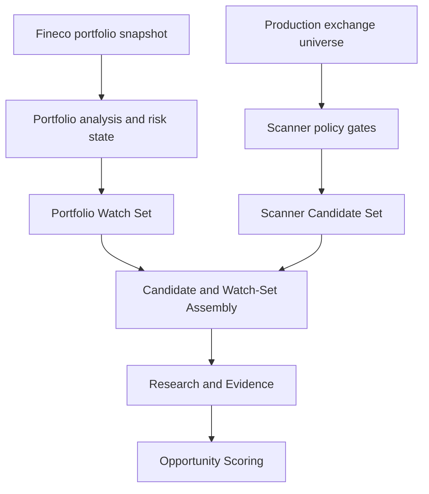
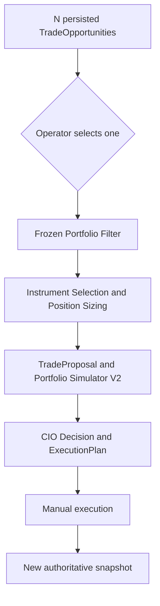

# Stage 4.0 — True Agentic Portfolio E2E Architecture

## 1. Document status

| Field | Value |
| --- | --- |
| Role | Current architecture source of truth for Stage 4.0 |
| Status | ACTIVE |
| Architecture baseline | `92b9518bd9d45ff197efd9d3b98d4e08d277c9e6` |
| Baseline date | 2026-09-23 |
| Last closed checkpoint | E2E-S2.2G — Full Selected-Opportunity Dry Run |
| Active checkpoint | Stage 4.0 first complete E2E target — NEXT / PROPOSED |
| Regression baseline | 1518 tests passed; 162 subtests passed |
| Previous architecture | `STAGE_3_0_ARCHITECTURE.md` — retained as historical baseline |
| Previous demo roadmap | `CIO_DEMO_ROADMAP.md` — retained as historical implementation record |

This document defines the target end-to-end architecture after the closure of
E2E-S2.2F. It supersedes the current-development architecture sections of the
Stage 3.0 documents without deleting or rewriting their historical record.

Implementation details remain governed by code, tests, accepted checkpoint
documents and frozen contracts. This document connects those components into a
single Stage 4.0 system model.

---

## 2. Purpose

Stage 4.0 evolves the project from a set of validated portfolio-analysis,
research, scoring and proposal components into one auditable agentic workflow.

The system must:

1. read the real portfolio and account state from Fineco;
2. discover a broad production universe independently of the current
   portfolio;
3. admit only listings that pass explicit instrument, identity, market-data,
   history-quality and liquidity policies;
4. keep current portfolio positions in the watch universe even when they would
   not qualify as new Scanner candidates;
5. research and score both new opportunities and existing exposures;
6. produce zero or more auditable `TradeOpportunity` objects;
7. require the operator to select exactly one opportunity before downstream
   portfolio construction;
8. apply the frozen Portfolio Filter and deterministic finance engines;
9. simulate the proposal before a CIO decision;
10. produce an execution plan while leaving real execution manual;
11. bind every output to inputs, policy versions, evidence and timestamps.

The architecture supports both LONG and SHORT ideas. It must also support
recent listings and IPOs without silently treating limited history as either a
normal mature history or an automatic rejection.

---

## 3. Architectural invariants

The following rules are non-negotiable across Stage 4.0.

### 3.1 Real state and proposed state are separate

- Fineco is the source of truth for real positions, cash and broker-visible
  account state.
- A simulated or proposed trade must never mutate the real portfolio snapshot.
- `REAL`, `SIMULATED` and `PROPOSED` states must remain distinguishable in
  data contracts, persistence and reports.
- A proposal becomes a real position only after external manual execution and a
  subsequent authoritative portfolio snapshot.

### 3.2 Python owns deterministic finance

Python components own:

- parsing and normalization;
- instrument taxonomy and eligibility;
- symbol mapping and market-data validation;
- exchange calendars and completed-session logic;
- FX conversion;
- history-quality, freshness and liquidity gates;
- technical indicators and quantitative metrics;
- portfolio constraints and marginal-risk calculations;
- instrument selection, sizing and simulation;
- persistence validation and audit hashes.

The LLM may interpret evidence and formulate reasoned recommendations. It must
not invent prices, quantities, liquidity, portfolio weights or risk values.

### 3.3 Unknown is safer than fabricated certainty

Missing, inconsistent or unverified data must produce explicit states such as
`UNKNOWN`, `UNDETERMINED`, `REVIEW_REQUIRED`, `UNAVAILABLE` or
`BLOCKED`.

No layer may silently convert missing evidence into a pass.

### 3.4 Listing identity is immutable

The source listing identity is the pair:

`(exchange, provider_symbol)`

Market-data symbols, cross-venue listings, ISINs and economic risk factors are
related identities, not replacements for the source listing key.

### 3.5 Human control remains mandatory

- The operator explicitly selects one opportunity for downstream evaluation.
- The system may recommend, reject, block or require review.
- The system does not place broker orders.
- Execution remains manual until a separate architecture and acceptance
  milestone explicitly changes this rule.

---

## 4. Canonical end-to-end workflow

Stage 4.0 has two upstream sources: the real portfolio and the external Scanner
universe. They converge into one research watch universe.



Opportunity Scoring may produce zero, one or many persisted opportunities.
Only an explicit operator choice opens the downstream decision path.



There is no implicit batch allocator between Opportunity Scoring and the
Portfolio Filter. A future multi-opportunity optimizer would require a new
architecture contract and cannot be introduced as an implementation detail.

---

## 5. Identity model

Stage 4.0 distinguishes four identity domains.

| Identity | Canonical key or value | Purpose |
| --- | --- | --- |
| Provider listing | `(exchange, provider_symbol)` | Acquisition, audit and exact venue identity |
| Security reference | ISIN when present | Cross-listing analysis and reference-data correlation |
| Market-data instrument | Provider-specific symbol, currently Yahoo | Price/history retrieval |
| Economic risk factor | Canonical underlying or mapped factor | Portfolio aggregation and risk |

Rules:

1. A Yahoo symbol never overwrites the provider listing identity.
2. The same ISIN on two venues is not proof that market-data identity,
   currency, liquidity or trading-session behavior is interchangeable.
3. Missing ISIN does not by itself make a common-stock listing ineligible.
4. Mapping to the same risk factor may permit exposure aggregation while
   position-level rows remain separate.
5. A mapping decision records its policy version, diagnostics and verification
   state.
6. Listing-start references are keyed by exact listing identity and are not
   transferable across venues.

---

## 6. Scanner architecture

The Scanner is a sequence of explicit, auditable gates. Passing one gate does
not imply that later gates will pass.

### 6.1 Universe acquisition — E2E-S2.1

The production universe layer:

- discovers and acquires provider exchange listings;
- composes venue-specific and aggregate providers;
- applies cache freshness and partial-result semantics;
- preserves raw provider fields;
- applies the frozen production exchange policy;
- records acquisition status per venue.

The accepted audit baseline observed:

- 24 production listing venues;
- 20 acquisition routes;
- 31,808 resulting listings.

These counts describe the accepted audit snapshot. They are not hard-coded
business invariants and may change with provider data.

### 6.2 Canonical taxonomy — E2E-S2.2A

Raw provider types are resolved into explicit canonical types. Raw values are
preserved. Unknown or unsupported values fail closed.

The taxonomy does not infer a canonical type from broad name substrings.
Security-form evidence may trigger review, but it does not silently rewrite the
provider taxonomy.

### 6.3 Instrument eligibility — E2E-S2.2B

Scanner V1 automatically admits only canonical `COMMON_STOCK` listings as new
opportunity candidates.

Every listing receives exactly one eligibility outcome:

- `ELIGIBLE`;
- `INELIGIBLE`;
- `REVIEW_REQUIRED`.

ETFs, ETCs, preferred shares and other deferred product classes require their
own market-data, scoring, execution and risk policies before future admission.

Eligibility for new candidates does not remove an existing position from the
Portfolio Watch Set.

### 6.4 Market-data mapping and verification — E2E-S2.2C

Market-data processing separates:

1. deterministic symbol resolution;
2. provider identity verification;
3. data availability;
4. persistent verification caching;
5. live verification and resumability.

The accepted offline audit resolved 14,444 eligible listing mappings and left
129 Romanian listings explicitly unmapped because the venue had no supported
Yahoo rule. Unsupported venues remain visible and fail closed.

Identity verification and history availability are separate decisions. A
syntactically resolved symbol is not automatically a verified instrument.

### 6.5 History quality and liquidity — E2E-S2.2D

The history layer validates:

- snapshot time and completed sessions;
- exchange calendar coverage;
- listing-reference validity;
- OHLC structure and price integrity;
- volume integrity;
- expected-session coverage;
- freshness;
- technical-input availability;
- history maturity;
- price unit and currency;
- exact-session FX conversion;
- liquidity.

The gate produces a route, not merely a Boolean:

| Route | Meaning |
| --- | --- |
| `STANDARD` | Mature history satisfies the standard analysis path |
| `RECENT_LISTING` | Verified recent listing has sufficient partial inputs for its explicit path |
| `BLOCKED` | A mandatory data-quality, freshness, identity or liquidity condition failed |

Recent-listing treatment requires a reviewed primary-source reference. A short
history without a validated listing start is not assumed to be an IPO.

The accepted real-listing pilot covers:

- NASDAQ `SPCX` — reviewed SpaceX IPO reference; history had reached standard
  maturity at the checkpoint;
- NYSE `LYNX` — reviewed Lyntris IPO reference; qualified for the
  recent-listing maturity route.

Both live observations remained blocked because Yahoo exposed an empty
provider-wide US session row for 2026-09-22. The row was classified explicitly
as `EMPTY_PROVIDER_SESSION`; the system did not erase the session or relax
freshness requirements.

---

## 7. Candidate Set and Portfolio Watch Set

The next assembly boundary must keep two semantically different populations.

### 7.1 Scanner Candidate Set

Contains listings that are eligible for a new opportunity and have passed the
required Scanner gates.

Each candidate must retain:

- exact listing identity;
- provider identity and raw fields;
- canonical instrument type;
- eligibility decision;
- Yahoo mapping decision;
- identity and availability verification;
- history route and gate outcomes;
- liquidity result;
- policy versions;
- source timestamps and snapshot identifiers;
- all review or degradation diagnostics.

### 7.2 Portfolio Watch Set

Contains current real portfolio positions that require monitoring, research or
potential action.

A position remains in this set even if:

- its instrument class is not eligible for new Scanner admission;
- its venue is unsupported for new Scanner candidates;
- its market-data mapping requires a portfolio-specific resolver;
- the appropriate action is HOLD, REDUCE, EXIT or HEDGE rather than a new entry.

### 7.3 Research Watch Universe

The Research Watch Universe is the auditable union of:

`Scanner Candidate Set ∪ Portfolio Watch Set`

The union must not discard provenance. A member may be:

- `NEW_CANDIDATE`;
- `CURRENT_POSITION`;
- both.

Deduplication must distinguish:

- exact listing equality;
- security equivalence;
- shared market-data symbol;
- shared economic risk factor.

These equivalences serve different purposes and must not be collapsed into one
generic ticker match.

---

## 8. Research and evidence

Research consumes the Research Watch Universe and produces normalized evidence,
not portfolio actions.

Evidence must retain:

- subject identity;
- source identity and URL where applicable;
- provider;
- event and publication timestamps;
- retrieval timestamp;
- evidence type;
- quality and relevance assessments;
- canonical semantic tags;
- degradation or missing-data diagnostics.

Research may use LLMs for extraction, synthesis and semantic classification,
but deterministic validation must enforce schemas, timestamps, identity and
source provenance.

An unavailable evidence provider must not erase the candidate. It produces an
explicit degraded evidence state that downstream policy can accept, penalize or
block.

---

## 9. Opportunity Scoring

Opportunity Scoring converts validated market, technical, risk and research
inputs into zero or more `TradeOpportunity` objects.

A `TradeOpportunity` must be:

- directional: LONG or SHORT;
- bound to an exact subject and market-data identity;
- bound to the relevant portfolio snapshot;
- supported by structured evidence;
- explicit about confidence and uncertainty;
- explicit about invalidation conditions and horizon;
- reproducible from stored inputs and policy versions;
- persistable before downstream selection.

Scoring ranks and explains opportunities. It does not size trades, choose a
broker instrument or mutate the portfolio.

Research and Opportunity Scoring contracts accepted under AI-8C.2 and AI-8C.3
remain frozen unless a dedicated change milestone reopens them.

---

## 10. Operator selection gate

Opportunity Scoring may output `N` opportunities. Downstream portfolio
construction accepts exactly one selected opportunity per evaluation run.

The selection record must contain:

- selected opportunity identifier;
- selection timestamp;
- operator identity when available;
- source scoring run;
- source portfolio snapshot;
- optional operator note;
- explicit disposition of non-selected opportunities.

No opportunity may enter the Portfolio Filter merely because it ranked first.
Ranking and selection are separate events.

---

## 11. Frozen Portfolio Filter

The Portfolio Filter evaluates the selected opportunity against the real
portfolio context before instrument construction.

It owns portfolio-aware gates including:

- exposure and concentration constraints;
- marginal-risk constraints;
- correlation and diversification effects;
- liquidity and history inputs required by its frozen contract;
- long/short compatibility;
- explicit rejection reasons.

The PF-1A through PF-1H acceptance baseline remains closed and frozen.
Stage 4.0 integration must adapt upstream and downstream boundaries to the
frozen filter rather than silently changing its semantics.

An accepted Scanner candidate is not guaranteed to pass the Portfolio Filter.

---

## 12. Instrument construction and simulation

After the selected opportunity passes the Portfolio Filter:

1. Instrument Selection resolves the tradable representation.
2. Position Sizing computes a deterministic proposed size.
3. `TradeProposal` records side, quantity, reference price, notional, costs,
   rationale and constraints.
4. Portfolio Simulator V2 applies the proposal to a copy of the real snapshot.
5. Pre-trade and post-trade metrics are compared.
6. The CIO Decision Engine returns an auditable decision.
7. An `ExecutionPlan` is produced only for an approved proposal.

Every downstream result must preserve the chain:

`listing → evidence → opportunity → selection → filter → instrument → size → simulation → decision`

The architecture must support:

- LONG and SHORT proposals;
- direct equity and approved derivative implementations;
- CFD or other broker-specific instruments only through explicit contracts;
- rejection without partial portfolio mutation;
- replay from persisted inputs.

The implementation and acceptance status of each downstream component remains
governed by its own checkpoint documents and tests. This architecture defines
their integration order; it does not declare unverified modules complete.

---

## 13. CIO decision and execution boundary

The CIO Decision Engine may produce outcomes such as:

- `APPROVE`;
- `REJECT`;
- `REVIEW_REQUIRED`;
- `BLOCKED`.

The exact enum remains governed by its canonical data contract.

The decision must distinguish:

- qualitative thesis;
- deterministic constraints;
- simulation impact;
- unresolved risks;
- evidence degradation;
- operator overrides, if permitted by a future explicit policy.

An approved decision produces an execution plan, not a broker order.

After manual execution:

1. Fineco remains authoritative;
2. a new snapshot captures the actual resulting position;
3. the system links the real outcome to the proposal when possible;
4. unexecuted, partially executed or differently executed plans remain
   distinguishable;
5. learning and reporting operate on observed outcomes, not assumed fills.

---

## 14. Canonical state and persistence

Stage 4.0 persistence should represent immutable run records and explicit links
between them.

| Record | Required relationship |
| --- | --- |
| Portfolio snapshot | Authoritative account and position state at a time |
| Universe acquisition run | Provider and exchange acquisition evidence |
| Listing taxonomy decision | Raw type to canonical type |
| Eligibility decision | Listing to admission status |
| Market-data mapping | Listing to provider symbol and diagnostics |
| Verification result | Identity and availability evidence |
| History-quality result | Listing, snapshot time, gates and route |
| Candidate-set run | Accepted new candidates |
| Watch-set run | Current positions and provenance |
| Research run | Subject to evidence set |
| Scoring run | Evidence/features to opportunities |
| Operator selection | One chosen opportunity |
| Portfolio Filter result | Opportunity and snapshot to pass/reject |
| Trade proposal | Instrument and deterministic sizing |
| Simulation | Before/after portfolio state |
| CIO decision | Proposal and simulation to decision |
| Execution plan | Approved decision to manual actions |
| Execution outcome | Observed broker result and new snapshot |

Persistence must support:

- stable identifiers;
- schema and policy versions;
- aware timestamps;
- input hashes or equivalent integrity links;
- append-oriented audit history;
- deterministic serialization where contracts require it;
- replay without hidden reliance on process memory.

SQLite remains an acceptable local persistence technology. The architecture
does not depend on SQLite-specific semantics and should preserve clear
repository boundaries.

---

## 15. LLM boundary

### Allowed LLM responsibilities

- summarize and compare evidence;
- extract structured claims from source text;
- classify themes, catalysts and risks;
- generate thesis and counter-thesis;
- explain a score or CIO recommendation;
- identify missing evidence and request review;
- generate operator-readable reports from canonical data.

### Forbidden LLM responsibilities

- fabricate market data or sources;
- resolve listing identity without deterministic validation;
- override failed Scanner or Portfolio Filter gates;
- calculate final position size outside the deterministic engine;
- change real portfolio state;
- infer that an execution occurred;
- hide missing inputs behind narrative confidence;
- place broker orders.

Every LLM output used in a decision must be schema-validated and traceable to
its inputs, prompt/policy version and model metadata where available.

---

## 16. Failure and degradation semantics

Stage 4.0 prefers partial, explicit truth over fabricated completeness.

| Condition | Required behavior |
| --- | --- |
| Provider acquisition failure | Mark venue/run partial or failed; preserve successful venues |
| Unknown instrument type | Fail closed; preserve raw value |
| Security-form contradiction | Require review; do not silently reclassify |
| Unsupported symbol mapping | Unmapped with diagnostics |
| Identity mismatch | Do not use history for the listing |
| No history | Unavailable or blocked; preserve reason |
| Empty provider session | Preserve and classify explicitly; evaluate freshness fail closed |
| Stale history | Block dependent paths |
| Missing exact-date FX | Do not fabricate conversion |
| Unverified short history | Do not assume IPO or recent listing |
| Insufficient standard history | Consider only a verified recent-listing path |
| Insufficient liquidity | Block new candidate admission |
| Research provider degraded | Preserve candidate and mark evidence degradation |
| Portfolio constraint failed | Reject at Portfolio Filter |
| Simulation failed | No CIO approval or execution plan |
| Ambiguous execution outcome | Await authoritative snapshot or operator reconciliation |

Retries, caches and resumability may improve operations but must not change the
meaning of a policy decision.

---

## 17. Current checkpoint map

| Area | Checkpoint | Status at baseline |
| --- | --- | --- |
| Quantitative portfolio foundation | Stage 2.5 | CLOSED / FROZEN |
| Research and evidence contracts | AI-8C.2 | CLOSED / FROZEN |
| Opportunity scoring contracts | AI-8C.3 | CLOSED / FROZEN |
| Portfolio Filter | PF-1A through PF-1H | CLOSED / FROZEN |
| Exchange universe and provider policy | E2E-S2.1A through S2.1J | CLOSED |
| Instrument taxonomy | E2E-S2.2A | CLOSED |
| Instrument eligibility | E2E-S2.2B | CLOSED |
| Yahoo mapping and verification | E2E-S2.2C | CLOSED |
| History quality and liquidity | E2E-S2.2D | CLOSED |
| Candidate/watch-set assembly | E2E-S2.2E | CLOSED |
| Scanner-to-Research integration | E2E-S2.2F | CLOSED |
| Full selected-opportunity dry run | E2E-S2.2G | CLOSED |

“Closed” means accepted by its checkpoint evidence. It does not mean that
future providers or product classes are automatically supported.

---

## 18. Closed checkpoint: E2E-S2.2E

The closed checkpoint is:

**E2E-S2.2E — Candidate Set Assembly & Portfolio Watch Set**

### 18.1 Responsibilities

S2.2E implements:

1. consume closed S2.2A–S2.2D decisions;
2. assemble only fully admissible new Scanner candidates;
3. assemble the current Portfolio Watch Set from the authoritative snapshot;
4. union both sets without losing provenance;
5. deduplicate through explicit identity layers;
6. preserve `STANDARD` and `RECENT_LISTING` routes;
7. persist an immutable, auditable Research Watch Universe;
8. expose deterministic exclusion counts and reasons;
9. define the input contract for Research;
10. make zero network calls when replaying accepted cached inputs.

### 18.2 Minimum acceptance criteria

- Every source listing or position has a deterministic inclusion/exclusion
  result.
- Existing positions are not removed because they fail new-entry eligibility.
- Exact listing identity survives mapping, union and serialization.
- Duplicate handling is deterministic and tested for listing, ISIN,
  market-data-symbol and risk-factor collisions.
- Blocked and review-required Scanner listings cannot enter as new candidates.
- Recent-listing route metadata is preserved.
- Output ordering and serialization are deterministic.
- The run records policy versions, timestamps, source reports and counts.
- Cache-only replay is identical to the original accepted assembly.
- The full regression suite remains green.

The contract was approved on 2026-09-23. The implementation uses policy
`scanner-v1-candidate-watch-assembly`, version `1`.

For `STANDARD`, liquidity must pass. For a verified `RECENT_LISTING`, the only
permitted liquidity exception is `UNDETERMINED` with reason
`INSUFFICIENT_ALIGNED_VOLUME_HISTORY`, no failed gate, verified listing-start
evidence and no unrelated undetermined gate. This preserves the reviewed IPO
route without weakening identity, freshness, calendar, price, FX or coverage
requirements.

### 18.3 Closure evidence

The final cache-only audit consumed 31,808 eligibility decisions, admitted two
fresh `STANDARD` candidates (`BIT:A2A` and `XETRA:SAP`), retained all 33
non-flat Fineco positions and assembled 35 `READY` research members. The
assembly made zero network calls and emitted fingerprint
`881241c264bde82f3a9633d5766cc21c07a658bc11f43abc2202edd29aff1064`.

Expected negative decisions remained explicit: 17,178 ineligible instruments,
57 classification reviews, 129 unresolved mappings, 14,439 missing upstream
history results, two blocked histories and one verification not ready. The
complete regression closed at 1,491 tests and 162 subtests passed.

### 18.4 Next proposed checkpoint

Scanner-to-Research integration was the next proposed Stage 4.0 checkpoint after S2.2E.
It should consume the immutable Research Watch Universe, preserve member and
source provenance through Research and Opportunity Scoring, and persist zero
or more `TradeOpportunity` records without bypassing the existing evidence and
scoring contracts. Its contract must be reviewed before implementation.

---

## 19. Closed checkpoint: E2E-S2.2F

The approved Scanner-to-Research integration contract consumes the immutable
S2.2E Research Watch Universe without reopening the frozen AI-8C.2 Research or
AI-8C.3 Opportunity Scoring contracts.

For each `NEW_CANDIDATE`, it creates independent LONG and SHORT research
hypotheses so the adapter cannot inject directional bias. A
`CURRENT_POSITION` creates a `NO_ACTION` monitoring hypothesis that can produce
research but never automatically creates a new opportunity.

The integration persists deterministic Market Scans, Scan Candidates, evidence
bundles, Research, Opportunity Scores and explicit per-hypothesis outcomes.
Only a complete, sufficiently evidenced and sufficiently confident directional
hypothesis may create a broker-independent `TradeOpportunity`. A separate
provenance record links that opportunity to the Watch Universe, subject,
candidate, research, score, evidence, inferences and policy versions.

The run is resumable. Completed hypotheses are not fetched or inferred again;
failed, degraded and cache-miss hypotheses remain retriable. Cache-only replay
makes no provider or LLM calls. A zero-opportunity run is a valid outcome.

The implementation is present on the dedicated S2.2F branch and is closed by
the evidence below.

### 19.1 Closure evidence

The accepted S2.2E Watch Universe contained 35 `READY` members and deterministically
generated 37 hypotheses: independent LONG and SHORT hypotheses for the two new
candidates, plus 33 portfolio-monitoring hypotheses.

The cache-only pilot preserved run ID
`s2f-444373de3ccd1e6f41439998`, made no provider or LLM calls, created no
opportunity and recorded four retriable `CACHE_ONLY_MISS` outcomes. A defect
found by this pilot was corrected so `PENDING`, `FAILED` and `DEGRADED`
outcomes are never reported as completed hypotheses.

The bounded live pilot processed three hypotheses. `2BTC.DE` completed as
`PORTFOLIO_MONITOR` with reason `MONITOR_ONLY`. Independent `A2A.MI` LONG and
SHORT research both stopped fail-closed with `RESEARCH_NOT_COMPLETE`. Zero
`TradeOpportunity` records were produced, which is a valid integration result.

A terminal resume used a deliberately invalid model name and completed without
calling it. Terminal outcome payloads and timestamps remained unchanged,
proving deterministic skip behavior. The focused S2.2F suite closed at 12
tests passed. The complete project regression closed at 1,503 tests and 162
subtests passed.

### 19.2 Next proposed checkpoint

The next proposed Stage 4.0 checkpoint is the full selected-opportunity dry
run. Its contract must be reviewed and approved before implementation. It
should start from one explicitly selected persisted `TradeOpportunity` and
exercise the already-frozen downstream lifecycle without enabling automatic
execution or portfolio mutation.

---

## 20. Closed checkpoint: E2E-S2.2G

The approved checkpoint is:

**E2E-S2.2G — Full Selected-Opportunity Dry Run**

S2.2G is an orchestration checkpoint. It does not replace or reinterpret the
closed Portfolio Filter, Instrument Selection, Position Sizing, Trade
Proposal, Portfolio Simulator V2, CIO Decision or Execution Plan contracts.

The run consumes at most one explicitly selected, persisted S2.2F
`TradeOpportunity`. It validates the complete Scanner-to-Research provenance,
requires the current portfolio snapshot, then advances through the frozen
downstream lifecycle one stage at a time. Every stage records input and output
identities, fingerprints, reason codes and diagnostics. A policy block stops
the run without invoking later stages.

### 20.1 Explicit operator-input boundary

S2.2F correctly creates broker-independent opportunities without choosing
capital allocation or execution parameters. Its materialized opportunities
therefore contain neither target exposure nor maximum intended loss. The
approved S2.2G addendum resolves that open boundary with an explicit operator
overlay: exposure, loss limit, reference price, FX, stop and observation time.

These values are persisted and fingerprinted. They are never inferred. A
future observation or a conflict with an already persisted opportunity blocks
the run. This preserves the semantic boundary between AI-supported opportunity
discovery and deterministic portfolio/execution construction.

### 20.2 Dry-run safety invariant

The optional final Execution Plan remains subject to manual confirmation and
is marked as a non-authorized dry run. S2.2G cannot invoke a broker adapter,
confirm an execution or mutate the real portfolio. Its persisted counters must
remain:

```text
broker_orders_submitted = 0
portfolio_mutations = 0
automatic_executions = 0
```

### 20.3 Closure evidence

The focused suite passed 15 tests. The complete regression passed 1,518 tests
and 162 subtests. Real S2.2F replay `s2f-444373de3ccd1e6f41439998`
correctly stopped with `NO_SELECTABLE_OPPORTUNITY` as S2.2G run
`s2g-6d56888ea50a391b9a7b0dc0`.

The controlled ten-stage acceptance created a non-authorized dry-run plan and
proved terminal replay immutability. Both paths recorded zero broker orders,
zero portfolio mutations and zero automatic executions.

### 20.4 Next proposed checkpoint

The next proposed checkpoint is the Stage 4.0 first complete E2E target using
a future evidence-supported S2.2F opportunity. It must reuse the closed S2.2G
contract and remain manual-execution only.
---

## 21. Stage 4.0 first complete E2E target

The first complete Stage 4.0 dry run should demonstrate:

1. one authoritative Fineco snapshot;
2. one accepted production Scanner universe;
3. one persisted Research Watch Universe;
4. research and scoring for multiple members;
5. multiple persisted opportunities where evidence supports them;
6. one explicit operator selection;
7. one frozen Portfolio Filter result;
8. one deterministic instrument and sizing decision;
9. one TradeProposal;
10. one before/after portfolio simulation;
11. one CIO decision;
12. one execution plan or explicit rejection;
13. no broker mutation;
14. a complete replayable audit chain.

The dry run succeeds even when the final decision is rejection, provided the
rejection is correct, explicit and reproducible.

---

## 22. Non-goals

Stage 4.0 does not currently include:

- autonomous broker execution;
- hidden order routing;
- batch capital allocation across many opportunities;
- joint multi-opportunity optimization;
- silent inclusion of unsupported instrument classes;
- synthetic replacement of missing market data;
- automatic IPO inference from short history;
- LLM-calculated final financial metrics;
- mutation of a Fineco-derived real snapshot;
- background policy changes without versioned acceptance.

These capabilities require separate architecture decisions and checkpoints.

---

## 23. Documentation governance

The document hierarchy is:

1. `STAGE_4_0_ARCHITECTURE.md` — current end-to-end architecture;
2. accepted E2E, AI and PF checkpoint documents — detailed frozen contracts
   and evidence;
3. `STAGE_3_0_ARCHITECTURE.md` — historical architecture baseline;
4. `CIO_DEMO_ROADMAP.md` — historical demo and implementation roadmap.

Future checkpoint documents should link back to this architecture and state
whether they:

- implement an existing contract;
- refine an explicitly open boundary;
- or reopen a frozen contract.

Every Stage 4.0 checkpoint must update this file before closure. A checkpoint
is not `CLOSED` until the architecture update has passed validation and has
been committed and pushed with, or immediately after, the implementation.

Any reopened frozen contract requires:

- an explicit reason;
- impact analysis;
- migration strategy;
- updated tests;
- new acceptance evidence;
- a version change visible in persisted outputs.

---

## 24. Definition of architectural completion

Stage 4.0 is architecturally complete when:

- every boundary in the canonical E2E flow has a versioned data contract;
- the Scanner and Portfolio Watch Set feed one auditable Research Watch
  Universe;
- research and scoring can produce persisted opportunities for LONG and SHORT;
- exactly one opportunity is selected per downstream run;
- the frozen Portfolio Filter is integrated without semantic drift;
- proposal, simulation, CIO decision and execution planning are replayable;
- provider failures and unknowns remain explicit;
- recent listings use reviewed references and a distinct maturity route;
- real, simulated and proposed states never collapse into one another;
- the full workflow can be demonstrated without automatic execution;
- the final report links every decision to its source snapshot, evidence,
  policies and calculations.

Until those conditions are met, Stage 4.0 remains an active integration stage,
even when individual checkpoints are closed.
