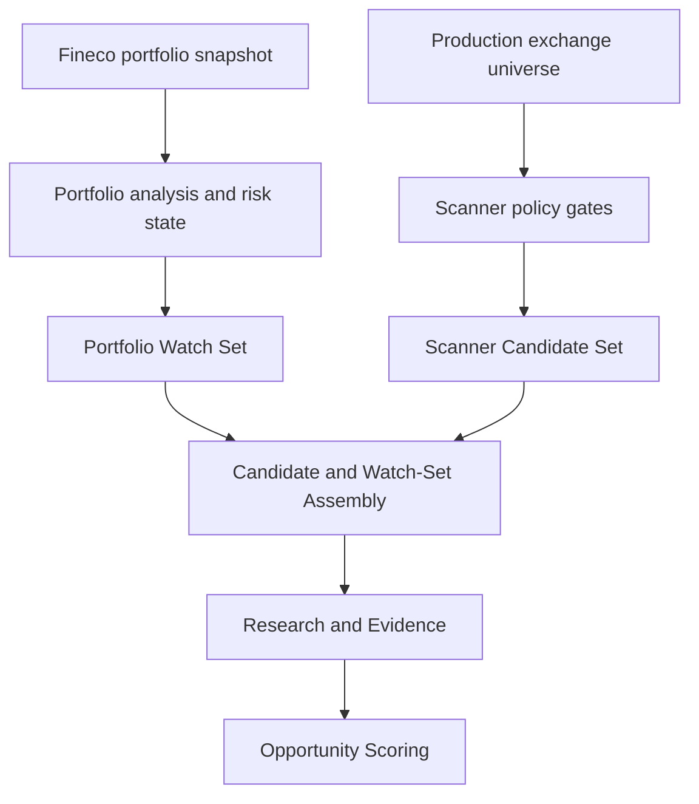
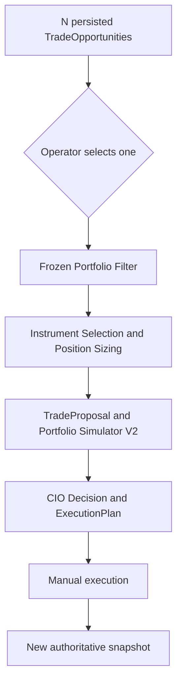

# Stage 4.0 — True Agentic Portfolio E2E Architecture

## 1. Document status

| Field | Value |
| --- | --- |
| Role | Current architecture source of truth for Stage 4.0 |
| Status | ACTIVE |
| Architecture baseline | `92b9518bd9d45ff197efd9d3b98d4e08d277c9e6` |
| Baseline date | 2026-09-23 |
| Last closed checkpoint | E2E-S4.0A.3 — Research Evidence Completion Bridge |
| Active checkpoint | E2E-S4.0A — First Complete E2E Target — LIVE COMPLETION IN PROGRESS |
| Regression baseline | 1654 tests passed; 162 subtests passed (canonical `tests/` collection; the former 1620 counted 18 duplicates) |
| Previous architecture | `STAGE_3_0_ARCHITECTURE.md` — retained as historical baseline |
| Previous demo roadmap | `CIO_DEMO_ROADMAP.md` — retained as historical implementation record |

This document defines the target end-to-end architecture after the closure of
E2E-S2.2F. It supersedes the current-development architecture sections of the
Stage 3.0 documents without deleting or rewriting their historical record.

Implementation details remain governed by code, tests, accepted checkpoint
documents and frozen contracts. This document connects those components into a
single Stage 4.0 system model.

---

## 2. Purpose

Stage 4.0 evolves the project from a set of validated portfolio-analysis,
research, scoring and proposal components into one auditable agentic workflow.

The system must:

1. read the real portfolio and account state from Fineco;
2. discover a broad production universe independently of the current
   portfolio;
3. admit only listings that pass explicit instrument, identity, market-data,
   history-quality and liquidity policies;
4. keep current portfolio positions in the watch universe even when they would
   not qualify as new Scanner candidates;
5. research and score both new opportunities and existing exposures;
6. produce zero or more auditable `TradeOpportunity` objects;
7. require the operator to select exactly one opportunity before downstream
   portfolio construction;
8. apply the frozen Portfolio Filter and deterministic finance engines;
9. simulate the proposal before a CIO decision;
10. produce an execution plan while leaving real execution manual;
11. bind every output to inputs, policy versions, evidence and timestamps.

The architecture supports both LONG and SHORT ideas. It must also support
recent listings and IPOs without silently treating limited history as either a
normal mature history or an automatic rejection.

---

## 3. Architectural invariants

The following rules are non-negotiable across Stage 4.0.

### 3.1 Real state and proposed state are separate

- Fineco is the source of truth for real positions, cash and broker-visible
  account state.
- A simulated or proposed trade must never mutate the real portfolio snapshot.
- `REAL`, `SIMULATED` and `PROPOSED` states must remain distinguishable in
  data contracts, persistence and reports.
- A proposal becomes a real position only after external manual execution and a
  subsequent authoritative portfolio snapshot.

### 3.2 Python owns deterministic finance

Python components own:

- parsing and normalization;
- instrument taxonomy and eligibility;
- symbol mapping and market-data validation;
- exchange calendars and completed-session logic;
- FX conversion;
- history-quality, freshness and liquidity gates;
- technical indicators and quantitative metrics;
- portfolio constraints and marginal-risk calculations;
- instrument selection, sizing and simulation;
- persistence validation and audit hashes.

The LLM may interpret evidence and formulate reasoned recommendations. It must
not invent prices, quantities, liquidity, portfolio weights or risk values.

### 3.3 Unknown is safer than fabricated certainty

Missing, inconsistent or unverified data must produce explicit states such as
`UNKNOWN`, `UNDETERMINED`, `REVIEW_REQUIRED`, `UNAVAILABLE` or
`BLOCKED`.

No layer may silently convert missing evidence into a pass.

### 3.4 Listing identity is immutable

The source listing identity is the pair:

`(exchange, provider_symbol)`

Market-data symbols, cross-venue listings, ISINs and economic risk factors are
related identities, not replacements for the source listing key.

### 3.5 Human control remains mandatory

- The operator explicitly selects one opportunity for downstream evaluation.
- The system may recommend, reject, block or require review.
- The system does not place broker orders.
- Execution remains manual until a separate architecture and acceptance
  milestone explicitly changes this rule.

---

## 4. Canonical end-to-end workflow

Stage 4.0 has two upstream sources: the real portfolio and the external Scanner
universe. They converge into one research watch universe.


```mermaid
flowchart TD
    A["Fineco portfolio snapshot"] --> B["Portfolio analysis and risk state"]
    B --> C["Portfolio Watch Set"]

    D["Production exchange universe"] --> E["Scanner policy gates"]
    E --> F["Scanner Candidate Set"]

    C --> G["Candidate and Watch-Set Assembly"]
    F --> G
    G --> H["Research and Evidence"]
    H --> I["Opportunity Scoring"]
```

Opportunity Scoring may produce zero, one or many persisted opportunities.
Only an explicit operator choice opens the downstream decision path.


```mermaid
flowchart TD
    A["N persisted TradeOpportunities"] --> B{"Operator selects one"}
    B --> C["Frozen Portfolio Filter"]
    C --> D["Instrument Selection and Position Sizing"]
    D --> E["TradeProposal and Portfolio Simulator V2"]
    E --> F["CIO Decision and ExecutionPlan"]
    F --> G["Manual execution"]
    G --> H["New authoritative snapshot"]
```

There is no implicit batch allocator between Opportunity Scoring and the
Portfolio Filter. A future multi-opportunity optimizer would require a new
architecture contract and cannot be introduced as an implementation detail.

---

## 5. Identity model

Stage 4.0 distinguishes four identity domains.

| Identity | Canonical key or value | Purpose |
| --- | --- | --- |
| Provider listing | `(exchange, provider_symbol)` | Acquisition, audit and exact venue identity |
| Security reference | ISIN when present | Cross-listing analysis and reference-data correlation |
| Market-data instrument | Provider-specific symbol, currently Yahoo | Price/history retrieval |
| Economic risk factor | Canonical underlying or mapped factor | Portfolio aggregation and risk |

Rules:

1. A Yahoo symbol never overwrites the provider listing identity.
2. The same ISIN on two venues is not proof that market-data identity,
   currency, liquidity or trading-session behavior is interchangeable.
3. Missing ISIN does not by itself make a common-stock listing ineligible.
4. Mapping to the same risk factor may permit exposure aggregation while
   position-level rows remain separate.
5. A mapping decision records its policy version, diagnostics and verification
   state.
6. Listing-start references are keyed by exact listing identity and are not
   transferable across venues.

---

## 6. Scanner architecture

The Scanner is a sequence of explicit, auditable gates. Passing one gate does
not imply that later gates will pass.

### 6.1 Universe acquisition — E2E-S2.1

The production universe layer:

- discovers and acquires provider exchange listings;
- composes venue-specific and aggregate providers;
- applies cache freshness and partial-result semantics;
- preserves raw provider fields;
- applies the frozen production exchange policy;
- records acquisition status per venue.

The accepted audit baseline observed:

- 24 production listing venues;
- 20 acquisition routes;
- 31,808 resulting listings.

These counts describe the accepted audit snapshot. They are not hard-coded
business invariants and may change with provider data.

### 6.2 Canonical taxonomy — E2E-S2.2A

Raw provider types are resolved into explicit canonical types. Raw values are
preserved. Unknown or unsupported values fail closed.

The taxonomy does not infer a canonical type from broad name substrings.
Security-form evidence may trigger review, but it does not silently rewrite the
provider taxonomy.

### 6.3 Instrument eligibility — E2E-S2.2B

Scanner V1 automatically admits only canonical `COMMON_STOCK` listings as new
opportunity candidates.

Every listing receives exactly one eligibility outcome:

- `ELIGIBLE`;
- `INELIGIBLE`;
- `REVIEW_REQUIRED`.

ETFs, ETCs, preferred shares and other deferred product classes require their
own market-data, scoring, execution and risk policies before future admission.

Eligibility for new candidates does not remove an existing position from the
Portfolio Watch Set.

### 6.4 Market-data mapping and verification — E2E-S2.2C

Market-data processing separates:

1. deterministic symbol resolution;
2. provider identity verification;
3. data availability;
4. persistent verification caching;
5. live verification and resumability.

The accepted offline audit resolved 14,444 eligible listing mappings and left
129 Romanian listings explicitly unmapped because the venue had no supported
Yahoo rule. Unsupported venues remain visible and fail closed.

Identity verification and history availability are separate decisions. A
syntactically resolved symbol is not automatically a verified instrument.

### 6.5 History quality and liquidity — E2E-S2.2D

The history layer validates:

- snapshot time and completed sessions;
- exchange calendar coverage;
- listing-reference validity;
- OHLC structure and price integrity;
- volume integrity;
- expected-session coverage;
- freshness;
- technical-input availability;
- history maturity;
- price unit and currency;
- exact-session FX conversion;
- liquidity.

The gate produces a route, not merely a Boolean:

| Route | Meaning |
| --- | --- |
| `STANDARD` | Mature history satisfies the standard analysis path |
| `RECENT_LISTING` | Verified recent listing has sufficient partial inputs for its explicit path |
| `BLOCKED` | A mandatory data-quality, freshness, identity or liquidity condition failed |

Recent-listing treatment requires a reviewed primary-source reference. A short
history without a validated listing start is not assumed to be an IPO.

The accepted real-listing pilot covers:

- NASDAQ `SPCX` — reviewed SpaceX IPO reference; history had reached standard
  maturity at the checkpoint;
- NYSE `LYNX` — reviewed Lyntris IPO reference; qualified for the
  recent-listing maturity route.

Both live observations remained blocked because Yahoo exposed an empty
provider-wide US session row for 2026-09-22. The row was classified explicitly
as `EMPTY_PROVIDER_SESSION`; the system did not erase the session or relax
freshness requirements.

---

## 7. Candidate Set and Portfolio Watch Set

The next assembly boundary must keep two semantically different populations.

### 7.1 Scanner Candidate Set

Contains listings that are eligible for a new opportunity and have passed the
required Scanner gates.

Each candidate must retain:

- exact listing identity;
- provider identity and raw fields;
- canonical instrument type;
- eligibility decision;
- Yahoo mapping decision;
- identity and availability verification;
- history route and gate outcomes;
- liquidity result;
- policy versions;
- source timestamps and snapshot identifiers;
- all review or degradation diagnostics.

### 7.2 Portfolio Watch Set

Contains current real portfolio positions that require monitoring, research or
potential action.

A position remains in this set even if:

- its instrument class is not eligible for new Scanner admission;
- its venue is unsupported for new Scanner candidates;
- its market-data mapping requires a portfolio-specific resolver;
- the appropriate action is HOLD, REDUCE, EXIT or HEDGE rather than a new entry.

### 7.3 Research Watch Universe

The Research Watch Universe is the auditable union of:

`Scanner Candidate Set ∪ Portfolio Watch Set`

The union must not discard provenance. A member may be:

- `NEW_CANDIDATE`;
- `CURRENT_POSITION`;
- both.

Deduplication must distinguish:

- exact listing equality;
- security equivalence;
- shared market-data symbol;
- shared economic risk factor.

These equivalences serve different purposes and must not be collapsed into one
generic ticker match.

---

## 8. Research and evidence

Research consumes the Research Watch Universe and produces normalized evidence,
not portfolio actions.

Evidence must retain:

- subject identity;
- source identity and URL where applicable;
- provider;
- event and publication timestamps;
- retrieval timestamp;
- evidence type;
- quality and relevance assessments;
- canonical semantic tags;
- degradation or missing-data diagnostics.

Research may use LLMs for extraction, synthesis and semantic classification,
but deterministic validation must enforce schemas, timestamps, identity and
source provenance.

An unavailable evidence provider must not erase the candidate. It produces an
explicit degraded evidence state that downstream policy can accept, penalize or
block.

---

## 9. Opportunity Scoring

Opportunity Scoring converts validated market, technical, risk and research
inputs into zero or more `TradeOpportunity` objects.

A `TradeOpportunity` must be:

- directional: LONG or SHORT;
- bound to an exact subject and market-data identity;
- bound to the relevant portfolio snapshot;
- supported by structured evidence;
- explicit about confidence and uncertainty;
- explicit about invalidation conditions and horizon;
- reproducible from stored inputs and policy versions;
- persistable before downstream selection.

Scoring ranks and explains opportunities. It does not size trades, choose a
broker instrument or mutate the portfolio.

Research and Opportunity Scoring contracts accepted under AI-8C.2 and AI-8C.3
remain frozen unless a dedicated change milestone reopens them.

---

## 10. Operator selection gate

Opportunity Scoring may output `N` opportunities. Downstream portfolio
construction accepts exactly one selected opportunity per evaluation run.

The selection record must contain:

- selected opportunity identifier;
- selection timestamp;
- operator identity when available;
- source scoring run;
- source portfolio snapshot;
- optional operator note;
- explicit disposition of non-selected opportunities.

No opportunity may enter the Portfolio Filter merely because it ranked first.
Ranking and selection are separate events.

---

## 11. Frozen Portfolio Filter

The Portfolio Filter evaluates the selected opportunity against the real
portfolio context before instrument construction.

It owns portfolio-aware gates including:

- exposure and concentration constraints;
- marginal-risk constraints;
- correlation and diversification effects;
- liquidity and history inputs required by its frozen contract;
- long/short compatibility;
- explicit rejection reasons.

The PF-1A through PF-1H acceptance baseline remains closed and frozen.
Stage 4.0 integration must adapt upstream and downstream boundaries to the
frozen filter rather than silently changing its semantics.

An accepted Scanner candidate is not guaranteed to pass the Portfolio Filter.

---

## 12. Instrument construction and simulation

After the selected opportunity passes the Portfolio Filter:

1. Instrument Selection resolves the tradable representation.
2. Position Sizing computes a deterministic proposed size.
3. `TradeProposal` records side, quantity, reference price, notional, costs,
   rationale and constraints.
4. Portfolio Simulator V2 applies the proposal to a copy of the real snapshot.
5. Pre-trade and post-trade metrics are compared.
6. The CIO Decision Engine returns an auditable decision.
7. An `ExecutionPlan` is produced only for an approved proposal.

Every downstream result must preserve the chain:

`listing → evidence → opportunity → selection → filter → instrument → size → simulation → decision`

The architecture must support:

- LONG and SHORT proposals;
- direct equity and approved derivative implementations;
- CFD or other broker-specific instruments only through explicit contracts;
- rejection without partial portfolio mutation;
- replay from persisted inputs.

The implementation and acceptance status of each downstream component remains
governed by its own checkpoint documents and tests. This architecture defines
their integration order; it does not declare unverified modules complete.

---

## 13. CIO decision and execution boundary

The CIO Decision Engine may produce outcomes such as:

- `APPROVE`;
- `REJECT`;
- `REVIEW_REQUIRED`;
- `BLOCKED`.

The exact enum remains governed by its canonical data contract.

The decision must distinguish:

- qualitative thesis;
- deterministic constraints;
- simulation impact;
- unresolved risks;
- evidence degradation;
- operator overrides, if permitted by a future explicit policy.

An approved decision produces an execution plan, not a broker order.

After manual execution:

1. Fineco remains authoritative;
2. a new snapshot captures the actual resulting position;
3. the system links the real outcome to the proposal when possible;
4. unexecuted, partially executed or differently executed plans remain
   distinguishable;
5. learning and reporting operate on observed outcomes, not assumed fills.

---

## 14. Canonical state and persistence

Stage 4.0 persistence should represent immutable run records and explicit links
between them.

| Record | Required relationship |
| --- | --- |
| Portfolio snapshot | Authoritative account and position state at a time |
| Universe acquisition run | Provider and exchange acquisition evidence |
| Listing taxonomy decision | Raw type to canonical type |
| Eligibility decision | Listing to admission status |
| Market-data mapping | Listing to provider symbol and diagnostics |
| Verification result | Identity and availability evidence |
| History-quality result | Listing, snapshot time, gates and route |
| Candidate-set run | Accepted new candidates |
| Watch-set run | Current positions and provenance |
| Research run | Subject to evidence set |
| Scoring run | Evidence/features to opportunities |
| Operator selection | One chosen opportunity |
| Portfolio Filter result | Opportunity and snapshot to pass/reject |
| Trade proposal | Instrument and deterministic sizing |
| Simulation | Before/after portfolio state |
| CIO decision | Proposal and simulation to decision |
| Execution plan | Approved decision to manual actions |
| Execution outcome | Observed broker result and new snapshot |

Persistence must support:

- stable identifiers;
- schema and policy versions;
- aware timestamps;
- input hashes or equivalent integrity links;
- append-oriented audit history;
- deterministic serialization where contracts require it;
- replay without hidden reliance on process memory.

SQLite remains an acceptable local persistence technology. The architecture
does not depend on SQLite-specific semantics and should preserve clear
repository boundaries.

---

## 15. LLM boundary

### Allowed LLM responsibilities

- summarize and compare evidence;
- extract structured claims from source text;
- classify themes, catalysts and risks;
- generate thesis and counter-thesis;
- explain a score or CIO recommendation;
- identify missing evidence and request review;
- generate operator-readable reports from canonical data.

### Forbidden LLM responsibilities

- fabricate market data or sources;
- resolve listing identity without deterministic validation;
- override failed Scanner or Portfolio Filter gates;
- calculate final position size outside the deterministic engine;
- change real portfolio state;
- infer that an execution occurred;
- hide missing inputs behind narrative confidence;
- place broker orders.

Every LLM output used in a decision must be schema-validated and traceable to
its inputs, prompt/policy version and model metadata where available.

---

## 16. Failure and degradation semantics

Stage 4.0 prefers partial, explicit truth over fabricated completeness.

| Condition | Required behavior |
| --- | --- |
| Provider acquisition failure | Mark venue/run partial or failed; preserve successful venues |
| Unknown instrument type | Fail closed; preserve raw value |
| Security-form contradiction | Require review; do not silently reclassify |
| Unsupported symbol mapping | Unmapped with diagnostics |
| Identity mismatch | Do not use history for the listing |
| No history | Unavailable or blocked; preserve reason |
| Empty provider session | Preserve and classify explicitly; evaluate freshness fail closed |
| Stale history | Block dependent paths |
| Missing exact-date FX | Do not fabricate conversion |
| Unverified short history | Do not assume IPO or recent listing |
| Insufficient standard history | Consider only a verified recent-listing path |
| Insufficient liquidity | Block new candidate admission |
| Research provider degraded | Preserve candidate and mark evidence degradation |
| Portfolio constraint failed | Reject at Portfolio Filter |
| Simulation failed | No CIO approval or execution plan |
| Ambiguous execution outcome | Await authoritative snapshot or operator reconciliation |

Retries, caches and resumability may improve operations but must not change the
meaning of a policy decision.

---

## 17. Current checkpoint map

| Area | Checkpoint | Status at baseline |
| --- | --- | --- |
| Quantitative portfolio foundation | Stage 2.5 | CLOSED / FROZEN |
| Research and evidence contracts | AI-8C.2 | CLOSED / FROZEN |
| Opportunity scoring contracts | AI-8C.3 | CLOSED / FROZEN — AI-8C.3-R1 (canonical technical volatility) ACCEPTED 2026-09-30; AI-8C.3-R2 (directional scoring) safety criteria ACCEPTED 2026-09-30, semantic follow-up AI-8C.3-R2.1 proposed |
| Portfolio Filter | PF-1A through PF-1H | CLOSED / FROZEN |
| Exchange universe and provider policy | E2E-S2.1A through S2.1J | CLOSED |
| Instrument taxonomy | E2E-S2.2A | CLOSED |
| Instrument eligibility | E2E-S2.2B | CLOSED |
| Yahoo mapping and verification | E2E-S2.2C | CLOSED |
| History quality and liquidity | E2E-S2.2D | CLOSED |
| Candidate/watch-set assembly | E2E-S2.2E | CLOSED |
| Scanner-to-Research integration | E2E-S2.2F | CLOSED |
| Full selected-opportunity dry run | E2E-S2.2G | CLOSED |
| Portfolio instrument coverage and leveraged-product risk adapters | E2E-S2.2H | CLOSED |
| Stage 4.0 First Complete E2E Target | E2E-S4.0A | APPROVED / IN PROGRESS |
| Research evidence completion bridge | E2E-S4.0A.3 | CLOSED |

“Closed” means accepted by its checkpoint evidence. It does not mean that
future providers or product classes are automatically supported.

---

## 18. Closed checkpoint: E2E-S2.2E

The closed checkpoint is:

**E2E-S2.2E — Candidate Set Assembly & Portfolio Watch Set**

### 18.1 Responsibilities

S2.2E implements:

1. consume closed S2.2A–S2.2D decisions;
2. assemble only fully admissible new Scanner candidates;
3. assemble the current Portfolio Watch Set from the authoritative snapshot;
4. union both sets without losing provenance;
5. deduplicate through explicit identity layers;
6. preserve `STANDARD` and `RECENT_LISTING` routes;
7. persist an immutable, auditable Research Watch Universe;
8. expose deterministic exclusion counts and reasons;
9. define the input contract for Research;
10. make zero network calls when replaying accepted cached inputs.

### 18.2 Minimum acceptance criteria

- Every source listing or position has a deterministic inclusion/exclusion
  result.
- Existing positions are not removed because they fail new-entry eligibility.
- Exact listing identity survives mapping, union and serialization.
- Duplicate handling is deterministic and tested for listing, ISIN,
  market-data-symbol and risk-factor collisions.
- Blocked and review-required Scanner listings cannot enter as new candidates.
- Recent-listing route metadata is preserved.
- Output ordering and serialization are deterministic.
- The run records policy versions, timestamps, source reports and counts.
- Cache-only replay is identical to the original accepted assembly.
- The full regression suite remains green.

The contract was approved on 2026-09-23. The implementation uses policy
`scanner-v1-candidate-watch-assembly`, version `1`.

For `STANDARD`, liquidity must pass. For a verified `RECENT_LISTING`, the only
permitted liquidity exception is `UNDETERMINED` with reason
`INSUFFICIENT_ALIGNED_VOLUME_HISTORY`, no failed gate, verified listing-start
evidence and no unrelated undetermined gate. This preserves the reviewed IPO
route without weakening identity, freshness, calendar, price, FX or coverage
requirements.

### 18.3 Closure evidence

The final cache-only audit consumed 31,808 eligibility decisions, admitted two
fresh `STANDARD` candidates (`BIT:A2A` and `XETRA:SAP`), retained all 33
non-flat Fineco positions and assembled 35 `READY` research members. The
assembly made zero network calls and emitted fingerprint
`881241c264bde82f3a9633d5766cc21c07a658bc11f43abc2202edd29aff1064`.

Expected negative decisions remained explicit: 17,178 ineligible instruments,
57 classification reviews, 129 unresolved mappings, 14,439 missing upstream
history results, two blocked histories and one verification not ready. The
complete regression closed at 1,491 tests and 162 subtests passed.

### 18.4 Next proposed checkpoint

Scanner-to-Research integration was the next proposed Stage 4.0 checkpoint after S2.2E.
It should consume the immutable Research Watch Universe, preserve member and
source provenance through Research and Opportunity Scoring, and persist zero
or more `TradeOpportunity` records without bypassing the existing evidence and
scoring contracts. Its contract must be reviewed before implementation.

---

## 19. Closed checkpoint: E2E-S2.2F

The approved Scanner-to-Research integration contract consumes the immutable
S2.2E Research Watch Universe without reopening the frozen AI-8C.2 Research or
AI-8C.3 Opportunity Scoring contracts.

For each `NEW_CANDIDATE`, it creates independent LONG and SHORT research
hypotheses so the adapter cannot inject directional bias. A
`CURRENT_POSITION` creates a `NO_ACTION` monitoring hypothesis that can produce
research but never automatically creates a new opportunity.

The integration persists deterministic Market Scans, Scan Candidates, evidence
bundles, Research, Opportunity Scores and explicit per-hypothesis outcomes.
Only a complete, sufficiently evidenced and sufficiently confident directional
hypothesis may create a broker-independent `TradeOpportunity`. A separate
provenance record links that opportunity to the Watch Universe, subject,
candidate, research, score, evidence, inferences and policy versions.

The run is resumable. Completed hypotheses are not fetched or inferred again;
failed, degraded and cache-miss hypotheses remain retriable. Cache-only replay
makes no provider or LLM calls. A zero-opportunity run is a valid outcome.

The implementation is present on the dedicated S2.2F branch and is closed by
the evidence below.

### 19.1 Closure evidence

The accepted S2.2E Watch Universe contained 35 `READY` members and deterministically
generated 37 hypotheses: independent LONG and SHORT hypotheses for the two new
candidates, plus 33 portfolio-monitoring hypotheses.

The cache-only pilot preserved run ID
`s2f-444373de3ccd1e6f41439998`, made no provider or LLM calls, created no
opportunity and recorded four retriable `CACHE_ONLY_MISS` outcomes. A defect
found by this pilot was corrected so `PENDING`, `FAILED` and `DEGRADED`
outcomes are never reported as completed hypotheses.

The bounded live pilot processed three hypotheses. `2BTC.DE` completed as
`PORTFOLIO_MONITOR` with reason `MONITOR_ONLY`. Independent `A2A.MI` LONG and
SHORT research both stopped fail-closed with `RESEARCH_NOT_COMPLETE`. Zero
`TradeOpportunity` records were produced, which is a valid integration result.

A terminal resume used a deliberately invalid model name and completed without
calling it. Terminal outcome payloads and timestamps remained unchanged,
proving deterministic skip behavior. The focused S2.2F suite closed at 12
tests passed. The complete project regression closed at 1,503 tests and 162
subtests passed.

### 19.2 Next proposed checkpoint

The next proposed Stage 4.0 checkpoint is the full selected-opportunity dry
run. Its contract must be reviewed and approved before implementation. It
should start from one explicitly selected persisted `TradeOpportunity` and
exercise the already-frozen downstream lifecycle without enabling automatic
execution or portfolio mutation.

---

## 20. Closed checkpoint: E2E-S2.2G

The approved checkpoint is:

**E2E-S2.2G — Full Selected-Opportunity Dry Run**

S2.2G is an orchestration checkpoint. It does not replace or reinterpret the
closed Portfolio Filter, Instrument Selection, Position Sizing, Trade
Proposal, Portfolio Simulator V2, CIO Decision or Execution Plan contracts.

The run consumes at most one explicitly selected, persisted S2.2F
`TradeOpportunity`. It validates the complete Scanner-to-Research provenance,
requires the current portfolio snapshot, then advances through the frozen
downstream lifecycle one stage at a time. Every stage records input and output
identities, fingerprints, reason codes and diagnostics. A policy block stops
the run without invoking later stages.

### 20.1 Explicit operator-input boundary

S2.2F correctly creates broker-independent opportunities without choosing
capital allocation or execution parameters. Its materialized opportunities
therefore contain neither target exposure nor maximum intended loss. The
approved S2.2G addendum resolves that open boundary with an explicit operator
overlay: exposure, loss limit, reference price, FX, stop and observation time.

These values are persisted and fingerprinted. They are never inferred. A
future observation or a conflict with an already persisted opportunity blocks
the run. This preserves the semantic boundary between AI-supported opportunity
discovery and deterministic portfolio/execution construction.

### 20.2 Dry-run safety invariant

The optional final Execution Plan remains subject to manual confirmation and
is marked as a non-authorized dry run. S2.2G cannot invoke a broker adapter,
confirm an execution or mutate the real portfolio. Its persisted counters must
remain:

```text
broker_orders_submitted = 0
portfolio_mutations = 0
automatic_executions = 0
```

### 20.3 Closure evidence

The focused suite passed 15 tests. The complete regression passed 1,518 tests
and 162 subtests. Real S2.2F replay `s2f-444373de3ccd1e6f41439998`
correctly stopped with `NO_SELECTABLE_OPPORTUNITY` as S2.2G run
`s2g-6d56888ea50a391b9a7b0dc0`.

The controlled ten-stage acceptance created a non-authorized dry-run plan and
proved terminal replay immutability. Both paths recorded zero broker orders,
zero portfolio mutations and zero automatic executions.

### 20.4 Next proposed checkpoint

The next proposed checkpoint is the Stage 4.0 first complete E2E target using
a future evidence-supported S2.2F opportunity. It must reuse the closed S2.2G
contract and remain manual-execution only.
---

## 21. Stage 4.0 first complete E2E target

The first complete Stage 4.0 dry run should demonstrate:

1. one authoritative Fineco snapshot;
2. one accepted production Scanner universe;
3. one persisted Research Watch Universe;
4. research and scoring for multiple members;
5. multiple persisted opportunities where evidence supports them;
6. one explicit operator selection;
7. one frozen Portfolio Filter result;
8. one deterministic instrument and sizing decision;
9. one TradeProposal;
10. one before/after portfolio simulation;
11. one CIO decision;
12. one execution plan or explicit rejection;
13. no broker mutation;
14. a complete replayable audit chain.

The dry run succeeds even when the final decision is rejection, provided the
rejection is correct, explicit and reproducible.

---

## 22. Non-goals

Stage 4.0 does not currently include:

- autonomous broker execution;
- hidden order routing;
- batch capital allocation across many opportunities;
- joint multi-opportunity optimization;
- silent inclusion of unsupported instrument classes;
- synthetic replacement of missing market data;
- automatic IPO inference from short history;
- LLM-calculated final financial metrics;
- mutation of a Fineco-derived real snapshot;
- background policy changes without versioned acceptance.

These capabilities require separate architecture decisions and checkpoints.

---

## 23. Documentation governance

The document hierarchy is:

1. `STAGE_4_0_ARCHITECTURE.md` — current end-to-end architecture;
2. accepted E2E, AI and PF checkpoint documents — detailed frozen contracts
   and evidence;
3. `STAGE_3_0_ARCHITECTURE.md` — historical architecture baseline;
4. `CIO_DEMO_ROADMAP.md` — historical demo and implementation roadmap.

Future checkpoint documents should link back to this architecture and state
whether they:

- implement an existing contract;
- refine an explicitly open boundary;
- or reopen a frozen contract.

Every Stage 4.0 checkpoint must update this file before closure. A checkpoint
is not `CLOSED` until the architecture update has passed validation and has
been committed and pushed with, or immediately after, the implementation.

Any reopened frozen contract requires:

- an explicit reason;
- impact analysis;
- migration strategy;
- updated tests;
- new acceptance evidence;
- a version change visible in persisted outputs.

---

## 24. Definition of architectural completion

Stage 4.0 is architecturally complete when:

- every boundary in the canonical E2E flow has a versioned data contract;
- the Scanner and Portfolio Watch Set feed one auditable Research Watch
  Universe;
- research and scoring can produce persisted opportunities for LONG and SHORT;
- exactly one opportunity is selected per downstream run;
- the frozen Portfolio Filter is integrated without semantic drift;
- proposal, simulation, CIO decision and execution planning are replayable;
- provider failures and unknowns remain explicit;
- recent listings use reviewed references and a distinct maturity route;
- real, simulated and proposed states never collapse into one another;
- the full workflow can be demonstrated without automatic execution;
- the final report links every decision to its source snapshot, evidence,
  policies and calculations.

Until those conditions are met, Stage 4.0 remains an active integration stage,
even when individual checkpoints are closed.

## 21. Closed corrective checkpoint: E2E-S2.2H

E2E-S2.2H — Portfolio Instrument Coverage & Leveraged-Product Risk Adapters
is an additive corrective checkpoint opened after the 2026-09-26 Fineco
portfolio refresh. It does not reopen the closed S2.2D–S2.2G contracts.

The checkpoint preserves every Fineco accounting market value while attaching
reviewed direct or leveraged-proxy risk factors to five previously unsupported
positions. Direction, data provenance, leverage application and expiry are
explicit and fail closed. The detailed contract is recorded in
`docs/E2E-S2.2H-PORTFOLIO-INSTRUMENT-COVERAGE.md`.

### 21.1 Closure evidence

The corrective checkpoint closed with 41/41 Fineco position identities,
37 direct histories, four reviewed leveraged proxies and five exact reviewed
instrument references. The offline audit made zero network calls.

The live provider pilot validated `KER.PA`, `DIA.MI`, `FCT.MI`, `MONC.MI` and
`BZU.MI`. The refreshed Portfolio Analysis preserved EUR 304,652.72 of Fineco
accounting gross exposure, reported 100% total weight and persisted
PortfolioSnapshot `SNAP-20260927-075500-6b4271`.

The workbook acceptance confirmed 41 position rows, 37 direct rows and four
proxy rows with explicit provenance. Direct provider/product price comparison
is disabled for proxy histories. The complete regression passed 1,532 tests
and 162 subtests.

The reported 94.83% extended analytical coverage is explained by the existing
minimum-history exclusions for `2BTC.DE`, `NBIS` and `SPCX`; it is not an
instrument-identity or market-data mapping gap.

### 21.2 Next proposed checkpoint

Stage 4.0 First Complete E2E Target is restored as the next proposed
checkpoint. Its contract must be approved before implementation. Execution
remains manual-only and no automatic broker action is authorized.

## 22. Active checkpoint: E2E-S4.0A

E2E-S4.0A — First Complete End-to-End Target is approved and in
progress. It is an integration and acceptance checkpoint: existing Stage 2,
PF-1, research, CIO and dry-run business contracts remain frozen. Any
compatibility failure must stop the run and be handled through a separately
approved contract change.

The target joins the current Fineco portfolio and Account State, portfolio
analysis, scanner discovery and gates, candidate/watch-set assembly, research
integration, one explicit operator selection and the existing selected-
opportunity dry run. The orchestration layer lives under `app/e2e`; it adds
lineage, persistence, resumability and acceptance evidence without duplicating
domain decisions.

### 22.1 First implementation block

The first block introduces immutable run and stage manifests, deterministic
fingerprints, SQLite persistence, cache-mode identity, terminal immutability and
tests for the frozen contract and safety invariants. It does not yet execute the
complete orchestration.

### 22.2 Acceptance tracks

Closure requires both a real-current-data track, which may legitimately wait,
block or remain partial, and a deterministic controlled track that traverses the
complete path using real business services with fixtures only at external
provider boundaries. Both tracks must prove zero broker orders, zero portfolio
mutations and zero automatic executions.

### 22.3 Publication intent

The approved architecture, contract boundaries, lineage model, safety invariants
and final acceptance evidence are versioned as source material for publication
in the Aleph Innovation Engineering Wiki after E2E-S4.0A closes.

### 22.4 Second implementation block

The second block adds the resumable E2E orchestrator and a thin adapter boundary
around the frozen business services. It validates explicit IDs and fingerprints
at every hand-off, reconstructs lineage from persisted stage payloads after a
crash, treats `PARTIAL/CACHE_ONLY_MISS` as resumable and keeps completed,
blocked, failed and operator-waiting runs immutable.

The orchestrator owns only control flow, lineage and safety validation. Portfolio
analysis, scanner discovery, watch-universe assembly, research integration and
the selected-opportunity dry run remain owned by their existing services. A
controlled complete path and fail-closed scenarios cover operator selection,
cache-only behavior, lineage mismatches and downstream safety violations.

### 22.5 Third implementation block

Block 3 adds canonical runtime wiring and a live command without changing
frozen domain contracts. PortfolioSnapshot, PortfolioRiskState, AccountState
and S2.2B-D reports are explicit and fingerprinted; no latest lookup is
allowed. The runtime delegates to S2.2E, S2.2F and S2.2G and retains the exact
watch report path for restart-safe resume.

### 22.7 Corrective sub-checkpoint: E2E-S4.0A.1

Real directional validation on A2A and SAP completed symmetrically and failed
closed because the available research evidence was incomplete. The approved
bounded candidate-replenishment layer advances to a canonical unattempted
scanner frontier when all current directional hypotheses are terminal and no
selectable opportunity exists. It preserves all S2.2 contracts and quality
thresholds, isolates portfolio monitoring from candidate discovery, limits
LIVE work to two listings per wave, five waves and one transient retry, and
persists every wave as append-only evidence. Implementation is in progress.

### 22.8 Bounded replenishment orchestration

The second E2E-S4.0A.1 implementation block adds a resumable outer orchestration
service. It consumes the deterministic frontier planner, executes at most two
listings per wave, preserves LONG/SHORT symmetry and continues until a selectable
`TradeOpportunity` exists. Persisted plan fingerprints are replayed rather than
executed again. Five-wave and one-retry budgets remain fail-closed, and all
broker-order, portfolio-mutation and automatic-execution counters remain zero.
The remaining block connects this tested control loop to LIVE history acquisition
and child S4.0A runs.

### 22.9 LIVE candidate-replenishment adapter

The third E2E-S4.0A.1 implementation block connects the bounded orchestration
loop to existing S2.2D history acquisition, S2.2E watch-universe assembly,
S2.2F research/scoring and child S4.0A lineage. Each wave is limited to two
listings and four symmetric directional hypotheses. Terminal investment-quality
exclusions advance the canonical frontier; the first selectable opportunity
stops replenishment and returns control to explicit operator selection.
CACHE_ONLY cannot invoke providers, LIVE transient failures receive one retry,
and no execution or portfolio mutation is authorized. Real acceptance and full
regression are pending.

### E2E-S4.0A.1 Block 3A — Acquisition-Capable Frontier

The first LIVE replenishment attempt terminated before wave creation because
the planner consumed the non-canonical `resolved_symbol` field while the
frozen S2.2C audit publishes `yahoo_symbol`. Block 3A corrects this adapter
boundary without changing the S2.2A–S2.2H contracts. The planner now exposes
counts for supported eligible listings, resolved mappings, attempted listings
and the remaining acquisition-capable frontier. `UNIVERSE_EXHAUSTED` is valid
only after that measured frontier reaches zero. Selected listings continue
through the existing LIVE S2.2D acquisition and quality gates before research.


### E2E-S4.0A.1 Block 3B — Terminal Review Routing

The replenishment runtime now distinguishes completed deterministic history
review routes from transient processing failures. `REVIEW_REQUIRED` and
`BLOCKED` listings become symmetric terminal
`EXCLUDED / EVIDENCE_UNAVAILABLE` outcomes, do not consume the technical
retry budget and advance the bounded frontier. `STANDARD` listings continue
through the existing Scanner-to-Research adapters, including mixed waves.

This is an orchestration correction only: existing scanner, research,
opportunity, risk and execution contracts remain unchanged. The checkpoint
continues to prohibit threshold relaxation, broker orders, portfolio mutation
and automatic execution. Implementation is complete; live validation on a
new immutable replenishment session is pending.


### E2E-S4.0A.1 Block 3C — Verification Clock Alignment

The acquisition-capable frontier now binds Yahoo identity verification,
availability evidence, history snapshot construction and quality evaluation
to the same immutable wave timestamp. This corrects the causal ordering that
previously produced `SNAPSHOT_NOT_KNOWN_AS_OF` when the provider used the
system clock a few milliseconds after the frozen orchestration timestamp.

No domain contract changed. The existing single-request
`YahooHistorySnapshotProvider` remains responsible for both verification and
snapshot evidence, avoiding duplicate network acquisition. All S2.2C/S2.2D
identity, freshness, structure, liquidity and maturity gates remain intact.
Implementation is complete; a new immutable LIVE replenishment session must
provide acceptance evidence before S4.0A.1 can close.

### E2E-S4.0A.1 Block 3D — Portfolio-Overlap-Safe Frontier

Clock-aligned LIVE evidence showed that an acquisition frontier must remain
disjoint from the root Portfolio Watch Set. `BIT:BZU` was already represented
through a leveraged-product proxy and `BIT:CPR` through a direct position.
Selecting them as new candidates caused the child lineage to violate the
four-directional-outcome invariant for a two-listing wave.

Block 3D excludes every resolved Yahoo identity carrying
`CURRENT_POSITION` provenance in the immutable root watch universe before
frontier selection. The exclusion set and overlap counts are persisted
separately from attempted listings, preserving exact provenance. A remaining
directional count mismatch is classified as a fatal orchestration invariant
and cannot enter the transient retry path. Wave attempts are ordered by their
actual start time when the same logical wave has multiple records.

This is a minimal orchestration correction. S2.2E identity grouping, S2.2F
research/scoring and all downstream risk and execution contracts remain
unchanged. A new immutable LIVE session must advance beyond the overlapping
BZU/CPR identities before this block can be accepted.

### E2E-S4.0A.1 Block 3E — Retry-Exhausted Candidate Quarantine

The Block 3D LIVE evidence distinguished two failure classes. BMPS/BPE
recovered on the single approved retry. ENEL/ENI did not: ENI SHORT first
failed an evidence-integrity validator and then encountered a transient Yahoo
news-provider failure. These outcomes must remain failed and cannot be
converted into investment evidence or a selectable opportunity.

Block 3E keeps every Research, scoring, risk and execution validator frozen.
It corrects only the replenishment scheduler: a `PROCESSING_FAILED` outcome is
retried once; if the retry is exhausted, the affected hypothesis and listing
are quarantined for that immutable session and the next unattempted frontier
wave is scheduled. Quarantine evidence includes outcome count, exact listing
and hypothesis IDs, reason counts and source Research run IDs. A fatal
`ORCHESTRATION_INVARIANT_VIOLATION` still causes an immediate safety stop, and
`max_waves` remains the global circuit breaker.

This preserves the approved objective of continuing bounded replenishment
until a selectable `TradeOpportunity` exists, while preventing one
candidate-local provider failure from terminating the entire universe search.
No threshold is relaxed and no broker or portfolio side effect is authorized.

### E2E-S4.0A.2 — News-Sensitive Acquisition Frontier

The non-semantic alphabetical/catalogue traversal exposed by LIVE bounded
replenishment is replaced by a versioned acquisition-priority layer. This is
an orchestration change only: all S2.2 eligibility, mapping, history,
liquidity, research, scoring and portfolio-risk gates remain normative.

The frontier target is 48 listings. Starting from a venue-balanced,
deterministic order derived from the immutable session fingerprint, LIVE
screens 48 unseen listings for recent price-sensitive news, keeps the `n`
qualified listings and then screens exactly `48 - n` fresh listings. A
listing without qualifying news is not screened again in the same session.
The loop stops at 48 qualified listings, provider-wide circuit break, frontier
exhaustion or 10 iterations.

Qualified listings are ranked by event severity, publication recency, direct
qualifying-item count, independent-source count and deterministic seeded key.
No LLM is used for this ranking. Missing or malformed provider evidence never
invents a score. Any unfilled positions use still-unscreened seeded listings
first; previously screened no-event listings are a last-resort fill only.

One immutable ranking snapshot is persisted per replenishment session. It
records the frontier-input fingerprint, policy, clock, iterations,
assessments, evidence IDs, qualified and fallback identities, network-call
count and circuit state. `CACHE_ONLY` makes zero news calls; resume reuses the
snapshot without refetching or reordering.

The same change set fixes the diagnosed NASDAQ turnover-conversion false
negative. Yahoo history, history quality and ECB FX evidence now share the
exact immutable wave clock. The FX conversion gate remains mandatory and
fail-closed.

Closure requires focused tests, a real multi-iteration LIVE ranking, proof of
snapshot replay, a NASDAQ `STANDARD` history route with valid EUR-converted
turnover evidence, complete regression and zero broker, portfolio or
automatic-execution side effects.

### E2E-S4.0A.3 — Research Evidence Completion Bridge

Live S4.0A.1/A.2 evidence proved that the replenishment and acquisition
frontier work, but directional hypotheses remained `RESEARCH_NOT_COMPLETE`
because the integration exposed market and news evidence without every
semantic dimension required by the frozen Research and Opportunity Scoring
contracts.

S4.0A.3 converts the canonical Stage-2 technical object into research evidence
before inference and reuses the same immutable object in scoring. Optional
Yahoo providers add source-backed fundamental and analyst/expectations
evidence. Missing fields are omitted; provider failures are isolated, explicit
and persisted.

No `PARTIAL` result is promoted, no evidence is fabricated and no completeness,
quality, score or confidence threshold changes. `CACHE_ONLY` makes zero
provider calls and all zero-side-effect invariants remain normative.

Closure requires five-kind evidence coverage when sources support it,
immutable-clock and provenance proof, isolated-provider failure evidence, a
controlled `COMPLETE + SCORED` path, live current-data evidence and complete
regression.

The first isolated LIVE bridge pilot processed CAG with all five evidence
kinds and all providers successful. It exposed two representation defects:
scorable analyst/current-price evidence did not trigger an Expectations
presence repair, and an exact debt value of 7,475,100,160 was rescaled by the
model to 74.75 billion. The corrective bridge now treats Expectations as a
conditionally required field only when explicit price-target comparisons are
available, reuses the existing targeted-repair boundary, and retains UNKNOWN
when that basis is absent. Fundamental monetary evidence carries both a
unit-aware scaled value and exact raw units. No completion or scoring gate is
relaxed.

The first fresh corrective replay reached the Expectations repair and exposed
a repair-scope defect rather than an evidence defect. The model attempted to
promote the research to `COMPLETE` while retaining material unknowns and
`requires_additional_research=true`; canonical validators rejected the result.
Expectations presence now authorizes only `expectations_assessment`.
`research_status` and `requires_additional_research` remain protected unless
an independent deterministic validator explicitly makes them repairable.

S4.0A.3 closed after a fresh empty-database LIVE replay persisted CAG evidence,
research and scoring lineage without creating a false TradeOpportunity. MARKET,
TECHNICAL, FUNDAMENTAL and ANALYST evidence were all available and cited; the
scoped repair populated `expectations_assessment=PARTIALLY_PRICED_IN` and left
no required context missing. The `0.5` evidence coverage score was correct:
three of six semantic dimensions were represented, while no current catalyst,
macro or news context existed. The terminal outcome was therefore the valid
fail-closed result `EXCLUDED / RESEARCH_NOT_COMPLETE`. Focused governance tests
passed and the complete regression closed with 1,620 tests and 162 subtests.
E2E-S4.0A remains active and returns to bounded replenishment for the next
candidate; no business threshold or execution policy was relaxed.

### AI-8C.3-R1 — Canonical Technical Volatility (reopened frozen contract)

Live S4.0A evidence showed that research almost never reaches `COMPLETE`:
189 of 191 persisted research records are `PARTIAL`. One structural cause was
internal. Stage 2 computes a deterministic 20-session annualized volatility,
but the frozen canonical technical input did not carry it, while the research
coverage validator treats a volatility unknown as material and incompatible
with `COMPLETE`.

AI-8C.3-R1 explicitly reopens AI-8C.3 to add `volatility_20d_pct` to
`CanonicalTechnicalInput` (contract `ai-8c3-canonical-technical-v2`), states
it in TECHNICAL evidence (`stage4-research-technical-v2`) and exposes it to
Opportunity Scoring (`opportunity-scoring-v12-canonical-technical-volatility`).
Undefined values stay `None`. No research, completeness, quality, score,
confidence or technical-base-score rule changes, and persisted v1 records are
not rewritten.

The change is necessary but not sufficient: only 3 of 151 recent research
records had volatility as their sole material unknown. Sector/peer context and
fundamentals remain the dominant evidence gaps. Reason, impact, migration,
tests and acceptance criteria are recorded in
`docs/AI-8C.3-R1-CANONICAL-TECHNICAL-VOLATILITY.md`. Acceptance requires a
fresh LIVE replenishment session through the validation harness
(`docs/E2E-S4.0A-VALIDATION-HARNESS.md`) with zero side effects.

Accepted on 2026-09-30 (validation run `20260930T122357Z`): all new TECHNICAL
evidence was v2 and stated volatility, and no new research or score listed
volatility as unknown or uncertain. The four research remained `PARTIAL`;
their remaining material unknowns are mostly forward-looking uncertainties
rather than evidence gaps.

Finding recorded for the next checkpoint: Opportunity Scoring is
direction-blind. The deterministic technical base and the scoring prompt do
not receive the hypothesis direction, so `NEW_LONG` and `NEW_SHORT` on the same
listing receive the same technical score (63 of 74 persisted pairs; median raw
score difference 2.86 points). Direction is applied only after eligibility.
Today this is masked because no research reaches `COMPLETE`; any change that
unblocks research completeness must be preceded by direction-aware scoring.

### AI-8C.3-R2 — Directional Opportunity Scoring (reopened frozen contract)

AI-8C.3-R2 reopens AI-8C.3 again to make Opportunity Scoring measure support
for the hypothesis direction. The scanner integration passes `LONG` or `SHORT`;
the deterministic technical base mirrors its directional contribution for
SHORT while keeping the RSI-extreme penalty as a risk; the prompt and repair
prompts state the direction; factor extraction and consistency diagnostics
mirror for SHORT; the persisted score diagnostics record the direction and its
source (`ai-8c3-directional-scoring-v1`, prompt
`opportunity-scoring-v13-directional`).

A new fail-closed materialization gate rejects any directional hypothesis whose
score was not computed for that direction (`SCORE_DIRECTION_MISMATCH`,
replenishable), including legacy direction-blind scores. Weights, calculator,
confidence and the 60 / 0.40 thresholds are unchanged, and the LONG technical
base is bit-identical to the previous mapping.

Offline, applying only the deterministic technical mirror to the 74
historical LONG/SHORT pairs removes every pair in which both directions scored
raw ≥ 60 (14 → 0). The semantic components depend on the model honouring the
direction and are verified in live acceptance through the validation harness.
Details: `docs/AI-8C.3-R2-DIRECTIONAL-SCORING.md`.

Live acceptance 2026-09-30 (four LONG/SHORT pairs): every score recorded its
hypothesis direction, no pair scored raw ≥ 60 on both sides, and side effects
stayed at zero. The technical component and the thesis followed the direction;
fundamentals did not (company-frame scores on both sides, including a 72.5
SHORT fundamental for a company with 37.9% revenue growth). The same run
produced the first live `COMPLETE` research and first `SCORED` score
(BAMI.MI `NEW_SHORT`, confidence-adjusted 56.6, below the 60 threshold).
Proposed next: AI-8C.3-R2.1, company-frame scoring with software mirroring for
fundamental and expectations, before AI-8C.2-R1.
